# CryptoAlarm Authentication & Database System Audit

## 🔍 **EXECUTIVE SUMMARY**

**Status**: ⚠️ **CRITICAL SECURITY VULNERABILITIES FOUND**  
**Overall Grade**: ⚠️ **C- (Major Issues Detected)**  
**Recommendations**: Immediate security remediation required before production deployment.

---

## 🏗️ **CURRENT ARCHITECTURE OVERVIEW**

### **Authentication Stack**
- **Primary Auth**: Supabase Authentication
- **State Management**: React Context (AuthContext)
- **Session Handling**: Supabase built-in session management
- **Database**: PostgreSQL via Supabase
- **Frontend Framework**: React + TypeScript + Vite

### **Service Layer Architecture**
```
┌─────────────────┐    ┌──────────────────┐    ┌─────────────────┐
│   React Pages   │ -> │   AuthContext    │ -> │  AuthService    │
└─────────────────┘    └──────────────────┘    └─────────────────┘
                                │                        │
                                v                        v
                       ┌──────────────────┐    ┌─────────────────┐
                       │  AlertService    │ -> │   Supabase      │
                       └──────────────────┘    └─────────────────┘
```

---

## 🚨 **CRITICAL SECURITY VULNERABILITIES**

### **1. EXPOSED CREDENTIALS (CRITICAL)**
**File**: `client/.env.local`  
**Issue**: Real Supabase credentials committed to repository
```bash
VITE_SUPABASE_URL=https://gyxwxnquqiaprgdeacwj.supabase.co
VITE_SUPABASE_ANON_KEY=eyJhbGciOiJIUzI1NiIsInR5cCI6IkpXVCJ9...
```
**Risk**: 🔴 **CRITICAL** - Database access exposed to public
**Impact**: Anyone with repository access can read/write your database

### **2. NO ROUTE PROTECTION**
**Issue**: No protected route components or guards
**Risk**: 🟠 **HIGH** - Unauthenticated users can access protected pages
**Pages Affected**: Profile, Alerts, Dashboard (partially protected)

---

## 🛡️ **ROUTE PROTECTION REQUIREMENTS**

### **🔒 Protected Routes (Require Authentication)**
These routes **MUST** redirect unauthenticated users to login page:

#### **High Security Routes**
- `/dashboard` - Main user dashboard with crypto monitoring
- `/alerts` - Alert management and notifications
- `/portfolio` - Portfolio tracking and management  
- `/profile` - User profile and account settings
- `/settings` - Application configuration
- `/premium` - Premium features and subscription

#### **Medium Security Routes**  
- `/crypto/:symbol` - Detailed crypto pages (with personalized features)
- `/help` - Help & support (with user-specific context)

#### **🌐 Public Routes (No Authentication Required)**
- `/` - Homepage (landing page)
- `/coming-soon` - Coming soon features
- `/terms` - Terms of service
- `/privacy` - Privacy policy  
- `/disclaimer` - Legal disclaimer
- `/contact` - Contact information
- `/auth` - Login/Register page

### **Authentication Flow Design**

```mermaid
graph TD
    A[User Visits Protected Route] --> B{Is User Authenticated?}
    B -->|Yes| C[✅ Allow Access to Page]
    B -->|No| D[🚫 Block Access]
    D --> E[Show Auth Modal/Redirect to Login]
    E --> F[User Signs In/Up]
    F --> G[Validate Credentials]
    G -->|Valid| H[✅ Redirect to Original Route]
    G -->|Invalid| I[❌ Show Error & Stay on Auth]
    H --> C
    I --> E
```



### **Protected Route Implementation Strategy**

#### **Option 1: Route-Level Protection (Recommended)**
```typescript
// Wrap protected routes in ProtectedRoute component
<Route path="/dashboard" element={
  <ProtectedRoute redirectTo="/auth" requireAuth>
    <Dashboard />
  </ProtectedRoute>
} />
```

#### **Option 2: Page-Level Guards**  
```typescript
// Check auth status within each protected page
const Dashboard = () => {
  const { isAuthenticated } = useAuth();
  
  if (!isAuthenticated) {
    return <AuthRequired />;
  }
  
  return <DashboardContent />;
};
```

#### **Option 3: HOC Pattern**
```typescript
// Higher-order component wrapper
export default withAuthRequired(Dashboard);
```

### **3. INSUFFICIENT ERROR HANDLING**
**Issue**: Auth errors not properly sanitized before display
**Risk**: 🟡 **MEDIUM** - Potential information leakage

### **4. NO RBAC/PERMISSIONS**
**Issue**: No role-based access control system
**Risk**: 🟡 **MEDIUM** - All authenticated users have same access level

---

## 📊 **DETAILED ANALYSIS BY COMPONENT**

### **🔐 AuthContext (`src/context/AuthContext.tsx`)**

**✅ Strengths:**
- Proper TypeScript typing
- Comprehensive state management
- Real-time auth state updates
- Profile management integration

**❌ Issues:**
- No token refresh handling shown
- Error states could be more granular
- Loading states could be optimized
- Missing auth state persistence verification

### **🛠️ AuthService (`src/services/authService.ts`)**

**✅ Strengths:**
- Clean service pattern
- Promise-based API
- Comprehensive auth methods (signup, signin, signout, reset)
- Proper error handling

**❌ Issues:**
- No rate limiting implementation
- Missing input sanitization
- No audit logging
- Password requirements not enforced

### **🗄️ Database Integration (`src/services/alertService.ts`)**

**✅ Strengths:**
- Automatic profile creation
- Row Level Security ready
- Comprehensive CRUD operations
- Real-time subscriptions
- Demo mode fallback

**❌ Issues:**
- Profile creation logic could fail silently
- No data validation on client side
- Missing pagination for large datasets
- No caching mechanism

### **🔒 Supabase Configuration (`src/lib/supabase.ts`)**

**✅ Strengths:**
- Environment variable validation
- Mock client for development
- Proper session persistence
- Reasonable defaults

**❌ Issues:**
- Mock client could mask integration issues
- No connection retry logic
- Missing health check capabilities

---

## 📋 **PAGE-BY-PAGE AUTH IMPLEMENTATION**

| Page | Auth Check | Protection Level | Issues |
|------|------------|------------------|---------|
| **Home** | ❌ None | Public | ✅ Correct |
| **Dashboard** | ✅ useAuth | Soft Protection | ⚠️ No redirect |
| **Alerts** | ✅ useAuth | Soft Protection | ⚠️ Shows message instead of redirect |
| **Portfolio** | ✅ useAuth | Soft Protection | ⚠️ No redirect |
| **Profile** | ✅ useAuth | Modal-based | ⚠️ Inconsistent UX |
| **Premium** | ❌ Assumed | Unknown | ⚠️ Needs audit |
| **CryptoDetail** | ❌ None | Public | ⚠️ Should show auth prompts for alerts |

### **🔍 Auth Pattern Analysis**

**Current Pattern (Inconsistent):**
```tsx
// Pattern A: Soft Protection (Dashboard, Alerts)
const { isAuthenticated } = useAuth()
if (!isAuthenticated) {
  return <div>Please sign in</div>
}

// Pattern B: Modal-based (Profile)
useEffect(() => {
  if (!user) setShowAuthModal(true)
}, [user])

// Pattern C: No protection (Home, CryptoDetail)
// No auth checks at all
```

---

## 🗃️ **DATABASE SCHEMA ANALYSIS**

### **Tables Identified:**
1. **`profiles`** - User profile data (extends auth.users)
2. **`alerts`** - User alerts and notifications
3. **`alert_conditions`** - Alert trigger conditions
4. **`alert_notifications`** - Notification settings
5. **`alert_logs`** - Alert execution history

### **Schema Strengths:**
- ✅ Proper foreign key relationships
- ✅ UUID primary keys
- ✅ Timestamped records
- ✅ Proper constraints and validations
- ✅ RLS (Row Level Security) ready structure

### **Schema Concerns:**
- ⚠️ No user roles/permissions table
- ⚠️ No audit trail for sensitive operations
- ⚠️ No data retention policies
- ⚠️ No API rate limiting tables

---

## 🚀 **RECOMMENDED IMMEDIATE ACTIONS**

### **🔥 CRITICAL (Do Immediately)**

1. **SECURE CREDENTIALS**
   ```bash
   # Remove from repository
   git rm --cached client/.env.local
   echo "client/.env.local" >> .gitignore
   
   # Regenerate Supabase keys
   # Create new project or rotate keys in Supabase dashboard
   ```

2. **IMPLEMENT PROTECTED ROUTES**
   ```tsx
   // Create ProtectedRoute component
   const ProtectedRoute = ({ children }: { children: ReactNode }) => {
     const { isAuthenticated, loading } = useAuth()
     
     if (loading) return <LoadingSpinner />
     if (!isAuthenticated) return <Navigate to="/auth" replace />
     
     return <>{children}</>
   }
   ```

3. **ADD ENVIRONMENT VALIDATION**
   ```typescript
   // Add to app initialization
   const requiredEnvVars = [
     'VITE_SUPABASE_URL',
     'VITE_SUPABASE_ANON_KEY'
   ]
   
   requiredEnvVars.forEach(key => {
     if (!import.meta.env[key]) {
       throw new Error(`Missing required environment variable: ${key}`)
     }
   })
   ```

### **🟠 HIGH PRIORITY (Within 1 Week)**

4. **IMPLEMENT PROPER ERROR HANDLING**
5. **ADD INPUT VALIDATION & SANITIZATION**
6. **CREATE AUTH GUARDS & REDIRECTS**
7. **IMPLEMENT LOADING STATES**
8. **ADD AUDIT LOGGING**

### **🟡 MEDIUM PRIORITY (Within 1 Month)**

9. **IMPLEMENT RBAC SYSTEM**
10. **ADD RATE LIMITING**
11. **OPTIMIZE DATABASE QUERIES**
12. **ADD CACHING LAYER**
13. **IMPLEMENT DATA VALIDATION**

---

## 📈 **SUGGESTED IMPROVEMENTS & ENHANCEMENTS**

### **🔐 Enhanced Authentication Features**

1. **Multi-Factor Authentication (MFA)**
   - SMS/Email verification
   - TOTP support
   - Backup codes

2. **Social Login Integration**
   - Google OAuth
   - GitHub OAuth
   - Apple Sign-In

3. **Advanced Security Features**
   - Device tracking
   - Session management
   - Suspicious activity detection

### **🗄️ Database Optimizations**

1. **Performance Enhancements**
   - Query optimization
   - Proper indexing
   - Connection pooling
   - Redis caching

2. **Data Management**
   - Automated backups
   - Data archival policies
   - GDPR compliance features

### **🔒 Security Hardening**

1. **API Security**
   - Rate limiting per user
   - Request throttling
   - IP-based restrictions
   - API key rotation

2. **Data Protection**
   - Field-level encryption
   - PII anonymization
   - Data loss prevention

---

## 🛠️ **IMPLEMENTATION ROADMAP**

### **Phase 1: Critical Security (Week 1)**
- [ ] Remove exposed credentials
- [ ] Implement protected routes
- [ ] Add proper error handling
- [ ] Environment validation

### **Phase 2: Auth Enhancement (Weeks 2-3)**
- [ ] Consistent auth patterns
- [ ] Loading states
- [ ] Form validation
- [ ] Audit logging

### **Phase 3: Advanced Features (Month 2)**
- [ ] Role-based access control
- [ ] MFA implementation
- [ ] Social login integration
- [ ] Advanced security monitoring

### **Phase 4: Performance & Scale (Month 3)**
- [ ] Caching implementation
- [ ] Database optimization
- [ ] Real-time features
- [ ] Analytics & monitoring

---

## ⚠️ **PRODUCTION READINESS CHECKLIST**

**Security:**
- [ ] All credentials secured
- [ ] Environment variables properly configured
- [ ] Protected routes implemented
- [ ] Input validation added
- [ ] Error handling improved
- [ ] Audit logging enabled

**Performance:**
- [ ] Database queries optimized
- [ ] Caching strategy implemented
- [ ] Loading states added
- [ ] Error boundaries created

**User Experience:**
- [ ] Consistent auth flow
- [ ] Proper redirects
- [ ] Loading indicators
- [ ] Error messages improved

**Monitoring:**
- [ ] Error tracking (Sentry)
- [ ] Performance monitoring
- [ ] User analytics
- [ ] Security monitoring

---

## �️ **DETAILED ROUTE PROTECTION IMPLEMENTATION**

### **Step 1: Create ProtectedRoute Component**

Create `src/components/ProtectedRoute.tsx`:
```typescript
import React, { ReactNode } from 'react';
import { Navigate, useLocation } from 'react-router-dom';
import { useAuth } from '../context/AuthContext';
import AuthModal from './AuthModal';

interface ProtectedRouteProps {
  children: ReactNode;
  redirectTo?: string;
  showModal?: boolean;
  fallbackComponent?: React.ComponentType;
}

const ProtectedRoute: React.FC<ProtectedRouteProps> = ({ 
  children, 
  redirectTo = '/auth',
  showModal = false,
  fallbackComponent: FallbackComponent
}) => {
  const { isAuthenticated, loading } = useAuth();
  const location = useLocation();
  const [showAuthModal, setShowAuthModal] = React.useState(false);

  // Show loading spinner while checking auth
  if (loading) {
    return (
      <div className="min-h-screen flex items-center justify-center bg-gradient-to-br from-[#0B1426] via-[#0F1837] to-[#1A1B3A]">
        <div className="animate-spin rounded-full h-32 w-32 border-b-2 border-[#3861FB]"></div>
      </div>
    );
  }

  // If not authenticated, handle based on props
  if (!isAuthenticated) {
    // Store intended destination for redirect after login
    sessionStorage.setItem('redirectAfterAuth', location.pathname);
    
    if (showModal) {
      return (
        <>
          <div className="blur-sm pointer-events-none">
            {children}
          </div>
          <AuthModal 
            isOpen={true} 
            onClose={() => {}} // Prevent closing without auth
          />
        </>
      );
    }
    
    if (FallbackComponent) {
      return <FallbackComponent />;
    }
    
    // Default: redirect to auth page
    return <Navigate to={redirectTo} state={{ from: location }} replace />;
  }

  return <>{children}</>;
};

export default ProtectedRoute;
```

### **Step 2: Create AuthRequired Fallback Component**

Create `src/components/AuthRequired.tsx`:
```typescript
import React from 'react';
import { Link } from 'react-router-dom';
import { Button } from './ui/button';
import { Card, CardContent, CardHeader, CardTitle } from './ui/card';
import { Shield, LogIn, UserPlus } from 'lucide-react';

const AuthRequired: React.FC = () => {
  return (
    <div className="min-h-screen bg-gradient-to-br from-[#0B1426] via-[#0F1837] to-[#1A1B3A] flex items-center justify-center p-4">
      <Card className="w-full max-w-md bg-gray-900/50 border-gray-700 backdrop-blur-md">
        <CardHeader className="text-center pb-4">
          <div className="mx-auto mb-4 p-3 bg-[#3861FB]/10 rounded-full w-fit">
            <Shield className="h-8 w-8 text-[#3861FB]" />
          </div>
          <CardTitle className="text-2xl font-bold text-white">
            Authentication Required
          </CardTitle>
          <p className="text-gray-400 mt-2">
            Please sign in to access this page and enjoy all CryptoAlarm features.
          </p>
        </CardHeader>
        
        <CardContent className="space-y-4">
          <div className="space-y-3">
            <Link to="/auth?mode=signin" className="block">
              <Button className="w-full bg-[#3861FB] hover:bg-[#2851FB] text-white">
                <LogIn className="h-4 w-4 mr-2" />
                Sign In to Continue
              </Button>
            </Link>
            
            <Link to="/auth?mode=signup" className="block">
              <Button variant="outline" className="w-full border-gray-600 text-gray-300 hover:bg-gray-800">
                <UserPlus className="h-4 w-4 mr-2" />
                Create Account
              </Button>
            </Link>
          </div>
          
          <div className="text-center pt-4">
            <p className="text-xs text-gray-500">
              New to CryptoAlarm? <Link to="/" className="text-[#3861FB] hover:underline">Learn more</Link>
            </p>
          </div>
        </CardContent>
      </Card>
    </div>
  );
};

export default AuthRequired;
```

### **Step 3: Update App.tsx with Protected Routes**

```typescript
import React from 'react';
import { BrowserRouter as Router, Routes, Route } from 'react-router-dom';
import { AuthProvider } from './context/AuthContext';
import { Toaster } from './components/ui/toast';
import ProtectedRoute from './components/ProtectedRoute';
import AuthRequired from './components/AuthRequired';

// Import pages
import Home from './pages/Home.tsx';
import Dashboard from './pages/Dashboard.tsx';
import Alerts from './pages/Alerts.tsx';
import Portfolio from './pages/Portfolio.tsx';
import Profile from './pages/Profile.tsx';
import ComingSoon from './pages/ComingSoon.tsx';
import Premium from './pages/Premium.tsx';
import Terms from './pages/Terms.tsx';
import Privacy from './pages/Privacy.tsx';
import Disclaimer from './pages/Disclaimer.tsx';
import Contact from './pages/Contact.tsx';
import NotFound from './pages/NotFound.tsx';
import CryptoDetail from './pages/CryptoDetail.tsx';
import AuthPage from './pages/Auth.tsx'; // Create this auth page

function App() {
  return (
    <AuthProvider>
      <Router>
        <div className="min-h-screen bg-background text-foreground">
          <Routes>
            {/* Public Routes */}
            <Route path="/" element={<Home />} />
            <Route path="/auth" element={<AuthPage />} />
            <Route path="/coming-soon" element={<ComingSoon />} />
            <Route path="/terms" element={<Terms />} />
            <Route path="/privacy" element={<Privacy />} />
            <Route path="/disclaimer" element={<Disclaimer />} />
            <Route path="/contact" element={<Contact />} />
            
            {/* Protected Routes - Require Authentication */}
            <Route path="/dashboard" element={
              <ProtectedRoute fallbackComponent={AuthRequired}>
                <Dashboard />
              </ProtectedRoute>
            } />
            
            <Route path="/alerts" element={
              <ProtectedRoute fallbackComponent={AuthRequired}>
                <Alerts />
              </ProtectedRoute>
            } />
            
            <Route path="/portfolio" element={
              <ProtectedRoute fallbackComponent={AuthRequired}>
                <Portfolio />
              </ProtectedRoute>
            } />
            
            <Route path="/profile" element={
              <ProtectedRoute fallbackComponent={AuthRequired}>
                <Profile />
              </ProtectedRoute>
            } />
            
            <Route path="/premium" element={
              <ProtectedRoute fallbackComponent={AuthRequired}>
                <Premium />
              </ProtectedRoute>
            } />
            
            {/* Semi-protected route - Enhanced features for logged in users */}
            <Route path="/crypto/:symbol" element={
              <ProtectedRoute showModal={true}>
                <CryptoDetail />
              </ProtectedRoute>
            } />
            
            {/* Catch all - 404 */}
            <Route path="*" element={<NotFound />} />
          </Routes>
          
          <Toaster 
            position="top-right"
            toastOptions={{
              style: {
                background: 'hsl(var(--card))',
                color: 'hsl(var(--card-foreground))',
                border: '1px solid hsl(var(--border))',
              },
            }}
          />
        </div>
      </Router>
    </AuthProvider>
  );
}

export default App;
```

### **Step 4: Enhanced AuthContext with Redirect Logic**

Update `src/context/AuthContext.tsx`:
```typescript
// Add to your existing AuthContext

const signIn = async (email: string, password: string) => {
  setLoading(true);
  setError(null);
  
  try {
    const { error } = await AuthService.signIn(email, password);
    
    if (error) {
      throw new Error(error);
    }
    
    // Handle redirect after successful login
    const redirectPath = sessionStorage.getItem('redirectAfterAuth');
    if (redirectPath) {
      sessionStorage.removeItem('redirectAfterAuth');
      window.location.href = redirectPath;
    }
    
    return { error: null };
  } catch (error: any) {
    setError(error.message);
    return { error: error.message };
  } finally {
    setLoading(false);
  }
};
```

### **Step 5: Create Dedicated Auth Page (Optional)**

Create `src/pages/Auth.tsx`:
```typescript
import React, { useEffect } from 'react';
import { useNavigate, useSearchParams } from 'react-router-dom';
import { useAuth } from '../context/AuthContext';
import AuthModal from '../components/AuthModal';

const AuthPage: React.FC = () => {
  const navigate = useNavigate();
  const [searchParams] = useSearchParams();
  const { isAuthenticated } = useAuth();
  const mode = searchParams.get('mode') || 'signin';

  useEffect(() => {
    if (isAuthenticated) {
      const redirectPath = sessionStorage.getItem('redirectAfterAuth') || '/dashboard';
      sessionStorage.removeItem('redirectAfterAuth');
      navigate(redirectPath, { replace: true });
    }
  }, [isAuthenticated, navigate]);

  if (isAuthenticated) {
    return null; // Will redirect via useEffect
  }

  return (
    <div className="min-h-screen bg-gradient-to-br from-[#0B1426] via-[#0F1837] to-[#1A1B3A] flex items-center justify-center p-4">
      <AuthModal 
        isOpen={true}
        onClose={() => navigate('/')}
        defaultMode={mode as 'signin' | 'signup'}
      />
    </div>
  );
};

export default AuthPage;
```

### **Step 6: Update AuthModal for Better UX**

Enhance your existing `AuthModal.tsx`:
```typescript
// Add these props to AuthModal interface
interface AuthModalProps {
  isOpen: boolean;
  onClose: () => void;
  defaultMode?: 'signin' | 'signup';
  required?: boolean; // Prevents closing without auth
}

// In AuthModal component, add:
const handleClose = () => {
  if (!required) {
    onClose();
  }
  // If required=true, don't close modal
};
```

---

## �📞 **SUPPORT & NEXT STEPS**

**Immediate Actions Required:**
1. Secure the exposed credentials (CRITICAL)
2. Implement protected routes (HIGH) 
3. Add proper error handling (HIGH)

**This audit revealed significant security vulnerabilities that must be addressed before any production deployment. The authentication system has a solid foundation but requires immediate security remediation and consistent implementation patterns.**

**Estimated Development Time:**
- Critical fixes: 2-3 days
- High priority items: 1-2 weeks  
- Complete system hardening: 1-2 months

---

*Generated on: October 26, 2025*  
*Audit Version: 1.0*  
*Next Review: After critical fixes implementation*